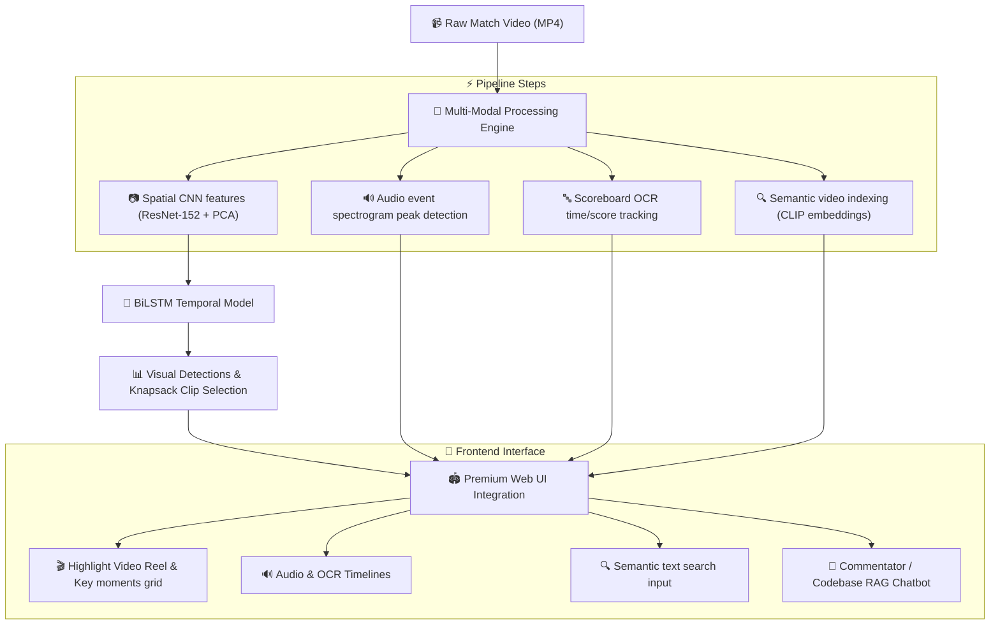

# ⚽ Football Highlight & Multi-Modal Analysis Hub

An advanced, end-to-end deep learning and multi-modal pipeline that automatically generates highlight reels from full-length football match videos and provides rich semantic features. 

The system features:
1. **Visual Event Detection**: A spatial-temporal deep learning pipeline using a **CNN (ResNet-152) Feature Extractor** + **PCA (2048→512)** + **Temporal BiLSTM Classifier** trained on the [SoccerNet](https://www.soccer-net.org/) dataset.
2. **Audio Event Analysis**: Spectrogram peak analysis to detect spectator crowd cheers and referee whistles.
3. **Scoreboard OCR Tracking**: Real-time broadcast scoreboard scanning to track game time and goal score updates.
4. **CLIP Semantic Search**: Zero-shot text-to-video clip retrieval using CLIP visual-text embeddings.
5. **Generative RAG Chatbot**: A dual-mode interactive chatbot serving as a match commentator and a codebase architecture expert.

All of these features are packaged into a **premium 3D Web UI dashboard** (built with Flask, vanilla CSS, and Three.js).

---

## 🏗️ System Architecture



### Two-Stage Spatial-Temporal Design

| Stage | Component | Purpose |
|---|---|---|
| **Spatial** | ResNet-152 + PCA | Extracts 2048-dim features, reduced to 512 via PCA (matching SoccerNet's feature format) |
| **Temporal** | BiLSTM Classifier | Processes sequences of 30 frames (15 seconds) at 2 FPS to identify matches and events |
| **Selection** | 0/1 Knapsack (DP) | Mathematically optimizes clip selections under a strictly user-defined duration budget |
| **Output** | MoviePy Stitcher | Cuts and concatenates video clips into the final highlight reel |

---

## 🎨 Premium Web Interface & Features

The user interface has been completely upgraded from Streamlit to a custom **Flask-backed Single Page Application (SPA)** featuring:
*   **3D Particle Background**: An interactive backdrop rendered in real-time via `Three.js`.
*   **Aesthetics**: Harmonious deep colors, HSL tailored neon indicators, glassmorphism card layouts, and subtle responsive hover micro-animations.
*   **3-Column Photo Grid**: A visual event gallery showcasing 12 evenly-spaced frame screenshot snapshots of key match moments with precise timestamps.
*   **Semantic Video Search**: Allows searching for arbitrary queries like "yellow card" or "goal celebrations" using multi-modal embeddings.
*   **AI Chatbot Assistant**: Ask questions about match context or deep dive into codebase architecture details.

---

## 📊 Model Performance & Results

Three architectures were trained and compared on the SoccerNet Action Spotting benchmark (60-match subset):

| Model | Test Accuracy | Test mAP | Val mAP (Best) | Epochs |
|---|---|---|---|---|
| CNN Baseline (FC layers) | 89.1% | 12.7% | 10.2% | 20 |
| **CNN + BiLSTM** | **96.3%** | **35.1%** | **38.4%** | 23 |
| CNN + Transformer | 93.9% | 8.9% | 10.3% | 18 |

> **Key Finding:** The BiLSTM architecture significantly outperforms both the baseline and the Transformer on this dataset size, achieving **35.1% mAP** — approximately half of the state-of-the-art (~70% mAP) while using only **12% of the training data** and a single free-tier Google Colab GPU.

---

## 🌐 Production Cloud Deployment (Vercel + Render)

To bypass cloud hosting file limits and run heavy ML frameworks, this project utilizes a **Split-Cloud Architecture**:

*   **Frontend (Vercel)**: Hosts the static user interface and the Three.js 3D animations. It is highly optimized and loads instantly.
*   **Backend (Render)**: Runs the Python server using Gunicorn. It handles all heavy calculations, loads the PyTorch checkpoints, parses OCR layouts, and extracts audio waveforms.

---

## 📁 Repository Structure

```
Football-Highlights-Detection/
├── api_server.py                       # Upgraded Flask API server backend
├── audio_classifier.py                 # Audio event analysis module
├── scoreboard_tracker.py               # OCR scoreboard reading module
├── clip_search.py                      # CLIP text-to-video search indexing module
├── chatbot_agent.py                    # RAG chatbot coordinator
├── match_summarizer.py                 # Generative AI summary module
├── requirements.txt                    # Python dependencies
├── .gitignore                          # Git ignore rules
├── checkpoints/                        # Trained model weights
│   ├── CNN_Baseline_best.pth           # Baseline model (1.9 MB)
│   ├── CNN_BiLSTM_best.pth             # Best model (38 MB)
│   └── CNN_Transformer_best.pth        # Transformer model (51 MB)
├── frontend/                           # HTML5/CSS3/JS Web UI
│   ├── index.html                      # 3D Dashboard structure
│   ├── app.js                          # SPA client logic & Three.js canvas
│   └── style.css                       # Sleek premium glassmorphic styling
├── results/                            # Active training metrics & plots
│   └── metrics_summary.json            # Model comparisons
└── upgrade/                            # Upgraded documentation files
    ├── HOW_TO_RUN_upgraded.md          # Upgraded running guide
    ├── TECHNICAL_DOCUMENTATION_upgraded.md # Upgraded code breakdown
    ├── System_Architecture_and_Workflow_upgraded.md # Upgraded workflow diagram details
    ├── Interview_Prep_Football_Highlight_Detection_upgraded.md # Upgraded prep questions
    └── VIVA_DEFENSE_GUIDE_upgraded.md   # Upgraded defense Q&A
```

---

## 🚀 How to Run Locally

For a complete local walkthrough, see the **[HOW_TO_RUN_upgraded.md](upgrade/HOW_TO_RUN_upgraded.md)** guide.

1. Install the required dependencies:
   ```bash
   pip install -r requirements.txt
   ```
2. Run the local Flask server:
   ```bash
   python api_server.py
   ```
3. Open your browser and navigate to `http://localhost:5000`.
