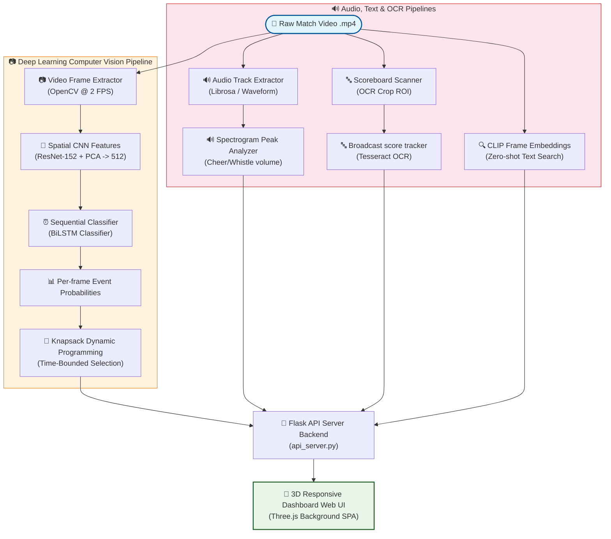

# 🏟️ Upgraded System Architecture and Workflow Bible

This document details the system design, algorithmic modules, and structural workflows of the Football Highlight & Multi-Modal Analysis Hub.

---

## 🏛️ System Architecture Workflow

The system is architected as a two-stage sequential computer vision pipeline extended with multi-modal metadata trackers (audio, text, and OCR).

---

## ⚙️ Core Pipeline Modules

### 1. Spatial-Temporal Event Spotting
*   **Spatial Feature Extractor**: Video frames are extracted at 2 frames per second (FPS), preprocessed, and sent through a pre-trained **ResNet-152** network to extract 2048-dimensional spatial vectors. A **PCA (Principal Component Analysis)** module reduces the features to 512 dimensions.
*   **Temporal Classifier**: A **Bidirectional LSTM (BiLSTM)** processes a sliding window of 30 frames (15 seconds of context) with 50% overlap. The bidirectional pass ensures each frame contains temporal context from both past and future actions.
*   **Knapsack Optimizer**: Detections exceeding the confidence threshold are passed to a **0/1 Knapsack Dynamic Programming (DP)** algorithm. This maps detected highlights as items with weights (duration) and values (confidence), optimizing the highlight reel compilation under a strict total duration constraint.
*   **MoviePy Stitcher**: Slices source frames according to event boundaries, applies crossfade transitions, and generates `highlights_<task_id>.mp4`.

### 2. Spectrogram Audio Event Classifier (`audio_classifier.py`)
*   Extracts the audio track from the match video.
*   Calculates the **STFT (Short-Time Fourier Transform)** to produce a spectrogram representing frequency magnitude over time.
*   Runs peak amplitude detection to identify sudden increases in sound energy.
*   Classifies crowd cheers (broadband high-energy spikes) and referee whistles (narrow high-frequency bands), outputting timestamped labels.

### 3. Scoreboard OCR Tracker (`scoreboard_tracker.py`)
*   Crops a region of interest (ROI) containing the scoreboard overlay (configurable to top-left or top-right).
*   Applies preprocessing (grayscale conversion, thresholding, contrast stretching) to clean the scoreboard image.
*   Runs **Optical Character Recognition (OCR)** using Tesseract to parse time digits and match scores.
*   Maintains a chronological timeline tracking score changes and game halves.

### 4. CLIP Semantic Text-to-Video Search (`clip_search.py`)
*   Samples video frames at 1.0 FPS.
*   Feeds frames through the **CLIP (Contrastive Language-Image Pretraining)** vision encoder to extract normalized visual embeddings.
*   Saves these embeddings in a fast local database index file (`clip.npz`).
*   Upon query, encodes search text (e.g. "corner kick", "headbutt", "referee yellow card") using the CLIP text encoder and computes the cosine similarity against frame embeddings to retrieve the top-matching moments.

### 5. AI Chatbot Coordinator (`chatbot_agent.py`)
*   Operates in dual modes: Match Commentator and Codebase Q&A.
*   Performs local keyword-based **Retrieval-Augmented Generation (RAG)**.
*   Indexes all markdown documentation files (specifically the files in the `upgrade/` folder) and splits them into section chunks.
*   Computes keyword frequency-inverse document frequency overlap scores to find the most relevant context blocks for code-related questions.

---

## 🎨 Interactive 3D Web UI Workflow

The interface is served by Flask as a Single Page Application (SPA):
1.  **3D Ambient backdrop**: An interactive canvas rendered with `Three.js` showing flying particles and a neon football wireframe structure reacting to mouse movements.
2.  **AJAX Polling Lifecycle**:
    *   The client uploads the `.npy` features and `.mp4` video files.
    *   The Flask server spawns a daemon thread to run the multi-modal pipeline and immediately responds with a `task_id`.
    *   The client polls `/api/progress/<task_id>` every 800ms, updating progress bars and state labels.
    *   Upon completion, the dashboard unlocks the results layout.
3.  **Dynamic Timeline & Moments Gallery**:
    *   A custom interactive canvas renders classification confidence curves over time.
    *   A **3-column photo grid** renders 12 key frame snapshots extracted dynamically via `/api/frame/<task_id>?t=seconds` using OpenCV.
